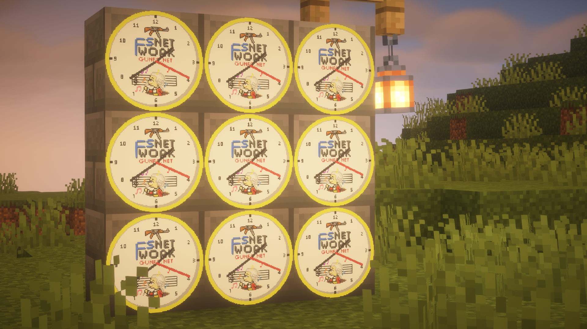

---
# MCClock

A Minecraft plugin that renders an analog clock onto a map item, showing the real-world time in a configurable timezone. Supports invisible item frames, tick sounds.

## Requirements

- Paper/Spigot 1.17+
- Java 17+

## Installation

1. Drop the `.jar` into your `plugins/` folder.
2. Restart the server.
3. Edit `plugins/MCClock/config.yml` as needed.
4. Use `/mcclock get` + `/mcclock getframe` separately.

## Configuration

`plugins/MCClock/config.yml`:

```yaml
# https://en.wikipedia.org/wiki/List_of_tz_database_time_zones
timezone: "Asia/Ho_Chi_Minh"

# Clock face image file (placed in plugins/MCClock/ folder)
clock-face: "clock_face.png"

item:
  name: "&bClock"
  lore:
    - "&7An analog clock."

hands:
  # Thickness of the clock hands (recommended: 1-2)
  thickness: 1

  # smooth: second hand moves continuously between ticks
  # tick: second hand jumps once per second
  mode: smooth

  # Compensation in milliseconds for network latency (try 500-1000 if clock appears behind)
  latency-compensation-ms: 0

tick-sound:
  # Play a tick sound for players near a clock frame
  enabled: true
  # Radius in blocks to hear the sound
  radius: 5.0
  # Volume (0.0 - 1.0)
  volume: 0.3
  # Pitch (higher = sharper tick)
  pitch: 2.0
  # Sound name — see https://hub.spigotmc.org/javadocs/spigot/org/bukkit/Sound.html
  sound: "BLOCK_NOTE_BLOCK_HAT"
```

You can replace `plugins/MCClock/clock_face.png` with a custom 128x128 image to change the clock face. The image will be scaled to 128×128 if larger and applied on the next `/mcclock reload`.

## Commands

| Command | Description |
|---|---|
| `/mcclock get [amount]` | Get 1–64 clock map items |
| `/mcclock getframe [amount]` | Get invisible item frame(s) — place on any wall like a normal frame |
| `/mcclock reload` | Reload config and re-attach the renderer |

Alias: `/mcc`  
All commands support **tab completion**.

## Permissions

| Permission | Description | Default |
|---|---|---|
| `mcclock.admin` | Access to all `/mcclock` commands | OP |
